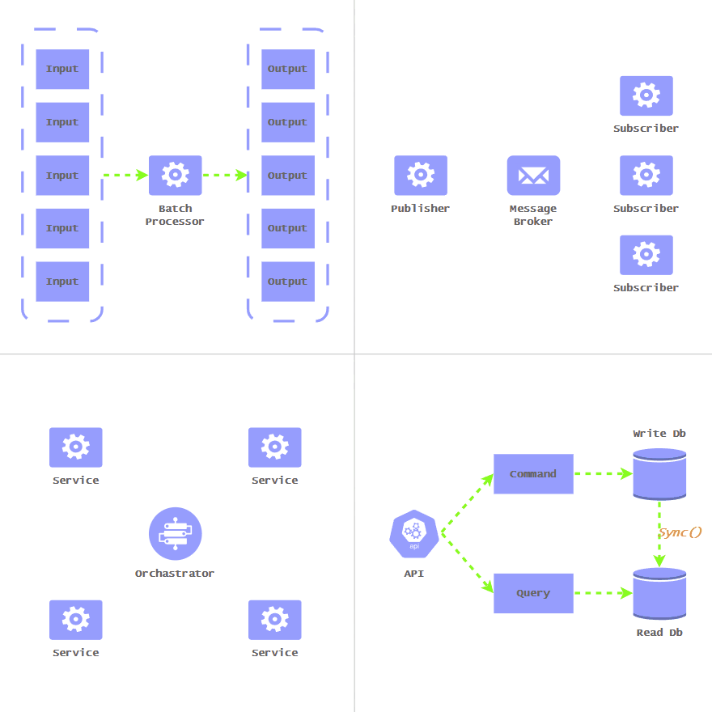

# 🏛️ Architecting Data Flow: Four Pillars Mental Model

###### WZM | Sunday, 16 August, 2026

 

Just as there are architectures for system structure and code organization, there are also architectures for data flow. When an architecture separates runtime boundaries and decouples logical components, data processing is no longer a single, monolithic step. Designing how data transitions across the system also becomes a necessary aspect of software architecture.

Consider a distributed software architecture where an upload task is divided across two separate runtime units:

- An upload API endpoint to receive the file.
- A hosted processing worker to handle the heavy lifting.

In this setup, because processing is distributed across these two boundaries, designing a reliable data flow between them to complete the overall task becomes a fundamental architectural challenge.

When architecting data flow, I usually like to break it down into four key pillars.

- ⚙️ Processing Model
- 💬 Communication Paradigm
- 🔄 Consistency & Distributed Workflow
- 📊 Data Modelling & Read/Write Optimization

## ⚙️ Processing Model

This pillar focuses on how data is computed, transformed, and processed over time. It defines whether computation happens on continuous, individual data points or on fixed, collective bulks.

- **Stream Processing:** A strategy where unbounded data is acted upon in real-time or near real-time as it arrives.
- **Batch Processing:** A strategy where large sets of data are processed in discrete, bounded chunks.

## 💬 Communication Paradigm

This pillar focuses on the degree of service coupling when data is moved between components. It defines how the components interact to move data, whether synchronously or asynchronously.

- **Synchronous communication:** A communication style where the connection between components during the interaction is synchronous and exhibits high temporal coupling–i.e., Request-Response such as RESTful and gRPC.
- **Asynchronous communication:** A communication style where the interaction between components is asynchronous and exhibits low temporal coupling–i.e., Pub/Sub such as RabbitMQ and Kafka.

## 🔄 Consistency & Distributed Workflow

This pillar focuses on the mechanisms necessary to support the integration of data state across distributed workflows. It defines how cross-service data transactions should be managed to keep the data accurate and consistent across decoupled boundaries.

> **Coordination → Sending → Receiving**

- **Distributed Transaction and Coordination:** Patterns for coordinating the workflow of distributed, multi-step business operations, covering strategies to manage data consistency when transitioning across multiple independent services–e.g., Saga Pattern.
- **Reliable Messaging (Sending):** Patterns for supporting reliable messaging, covering mechanisms to ensure events will not be lost following a committed data transaction–e.g., Transactional Outbox Pattern.
- **State Tracking (Receiving):** Patterns for ensuring valid message consumption, covering mechanisms to trace event states and safely process data across consuming services–e.g., Idempotency.

## 📊 Data Modelling & Read/Write Optimization

This pillar focuses on tactics to address the performance imbalance that occurs when a single database and data model serves both read and write purposes. It defines design patterns used to structure, model, and manage data optimized independently for reads and writes.

> **Write Operations:** Require a strict, normalized structure to protect data integrity, prevent duplication, and enforce complex business rules.  
>
> **Read Operations:** Often require denormalized, pre-joined, flat structures tailored to specific screen layouts or API responses.  
>
> Attempting to handle both workloads within a single database and data model typically leads to heavy table joins, slow queries, and severe performance bottlenecks.

- **Read/Write Separation:** An architectural design pattern to support read and write workloads to scale independently–e.g., CQRS.
- **Read/Write Data Model:** Data modelling patterns that structure tailored data models optimized for fast querying and writing–e.g., Event Sourcing, Projections.

## 💡 Key Takeaway

- Resolving execution and processing bottlenecks? → Processing Model
- Decoupling tightly bound services over time? → Communication Paradigm
- Integrating events and data management? → Consistency & Distributed Workflow
- Balancing conflicting read and write requirements? → Data Modelling & Read/Write Optimization
