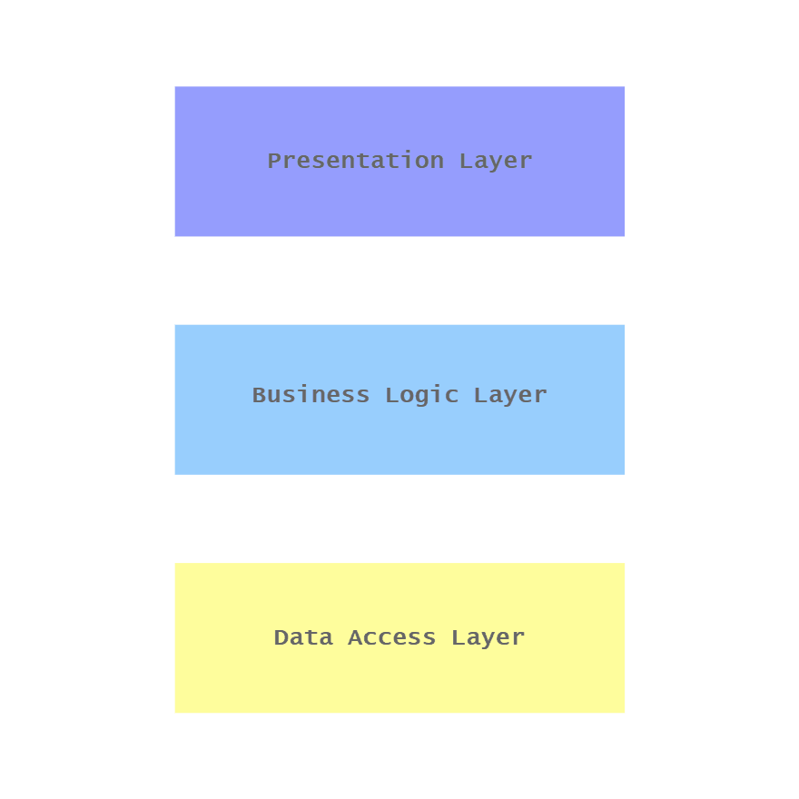

# 🖇 Relationship Between Software Architecture and Software Design: Architecture Draws the Sandbox, and Design Plays Inside it

###### WZM | Sunday, 19 July, 2026

 

When I first learned about software architecture, I assumed it was simply a higher-level approach to writing and implementing code. I often confused it with software design because both involve concepts such as components, interfaces, dependencies, and design patterns.

For example, when I was introduced to the N-Layer architecture, I initially interpreted it from a project structure perspective. I thought it simply meant organizing the codebase into presentation, business logic, and data access folders.

Over time, I realized that while architectural patterns do influence how code is organized, software architecture operates at a much higher level of abstraction. Using the same example, the N-Layer architecture defines the system's overall structure by separating it into presentation, business logic, and data access layers, establishing clear responsibilities and boundaries between them. Software design then focuses on the implementation details within those boundaries, dictating how classes, modules, and objects collaborate.

For instance, instead of separated folders, they should be treated as individual components/projects that have access boundaries. Because the architecture establishes these distinct layers, software design has to determine how data objects should interact across those boundaries—implementing Data Transfer Objects (DTOs) and the Mapper pattern as the design solution to bridge these layers while maintaining loose coupling.

## 🔬 The Intersection: A Top-Down Continuum

Software architecture and software design are complementary disciplines that exist in a top-down continuum.

### 🔎 Zoomed Out (Software Architecture)

- **Shapes the macro vision:** Sets the overall system structure, strategic organization, and boundaries.
- **Governs the system:** Dictates the high-level components and how they interact.
- **Establishes constraints:** Defines the foundational boundaries within which software design must operate.

### 🔍 Zoomed In (Software Design)

- **Executes the vision:** Focuses on the tactical construction of individual modules while adhering to architectural constraints.
- **Fills in the details:** Elaborates on the architectural foundation to map out the internal mechanics.
- **Shape the codebase:** Dictates how the implementation is built using algorithms, data structures, SOLID principles, and classic GoF patterns.

## 💡 Key Takeaway
| Dimension | Software Architecture | Software Design |
|:-----------|:-------------|:-------------|
|Role|**Provides** the structural foundation|**Implements** within that structural foundation|
|Focus|**Strategic layout:** System-wide structure, boundaries, and global trade-offs.|**Tactical implementation:** Local code structure, algorithms, and component internals.|
|Scope|**High-level** infrastructures, components, data flow.|**Low-level** modules, objects, and functional logic (code quality and execution).|