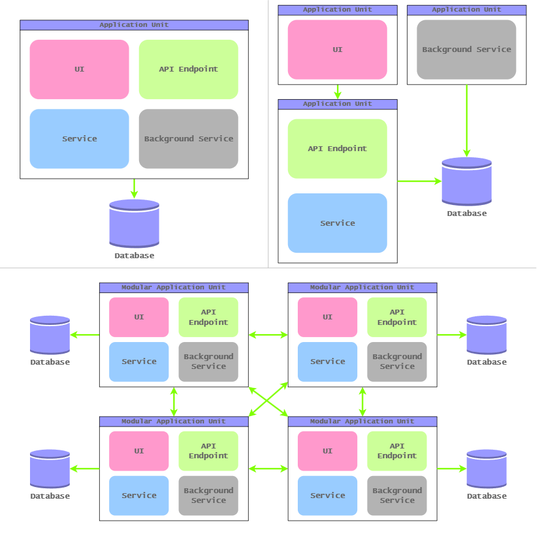
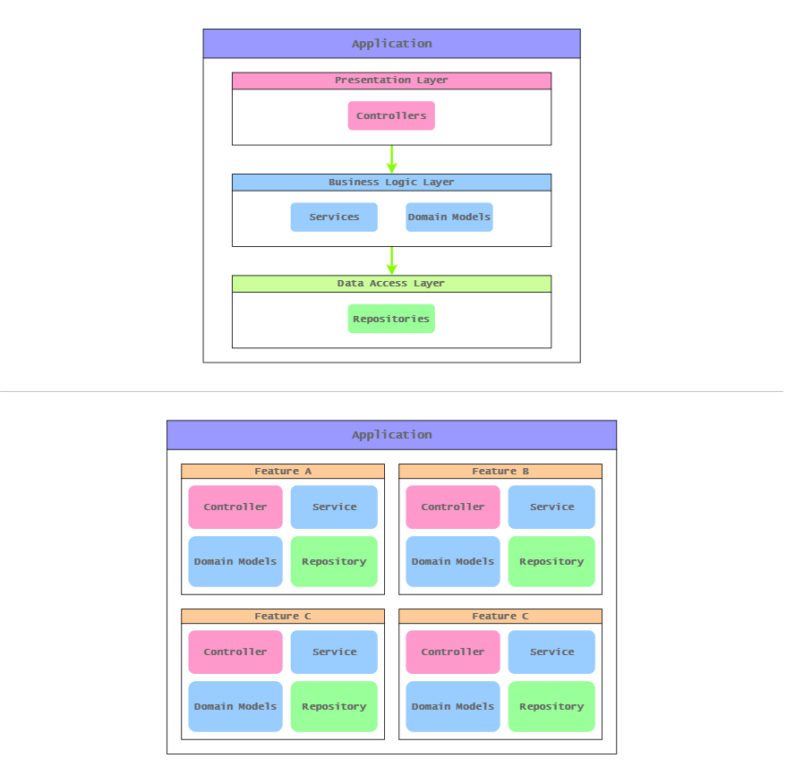

# ⚙️ Software Architecture in Action: Bundling Components into Units

###### WZM | Monday, 31 August, 2026

I like to think architecting software as structuring components into units. I view components in two levels:

- **System-level components** 
  Components that combine to constitute the entire, functioning system. Essential system components include UI, API Endpoint, Service, Background Service, and Database. For example, a basic online banking system may consist of components:
  - **UI:** The interface, screen where users interact with to perform online banking task.
  - **API Endpoint:** The interface where applications access online banking services.
  - **Service:** The core business services of online banking system.
  - **Background Service/Worker:** The core business services of online banking system but run asynchronously in the background.
  - **Database:** The infrastructure, OLTP database (e.g., PostgreSQL), to store online banking data.

- **Application-level components** 
  Components that combine to implement features and build a single application or service. Essential application components to implement a feature include API/Controller, Service, Repository, and Model/Domain. For example, a single fund transfer feature may consist of components:
  - **API/Controller:** The handler that routes incoming requests to the fund transfer service.
  - **Service:** The core business service or handler to perform fund transfer.
  - **Repository:** The data access object that interacts with the database to read and write fund transfer data.
  - **Model/Domain:** The data structures and domain logic that represent the fund transfer business objects and rules.

In the follwing section, I will demonstrate software architecture in action by showing how components can be bundled into units and organized. Throughout the process, we will explore the logic behind software architecture and how architectural designs can drives both maintainability, scalability, and complexity.

## 🏗️ Architecting System Components

 

Architecting a system is about defining its component layout and determining how those components are bundled into deployment units.

Let's start architecting a system consists of following components:
- UI
- API Endpoint
- Service
- Background Service/Worker
- Database

### 📦 All-in-One (Monolith)

The most direct approach is to bundle all components into a single unit. In this design, a single application does everything, handling all responsibilities, ranging from the UI and API endpoints to business services and background services, all backed by a shared database that stores the system's data.

Being an all-in-one, single application system, it has the lowest implementation complexity. However, because all components are bundled as a single unit, this design creates a bottleneck for scaling. For example, if we want to increase performance by scaling just the service component, we cannot do so independently; because everything is packaged together, the entire application must scale as a single block.

### 📦 Distributed (Distributed Monolith)

Bundling all components into a single unit creates a bottleneck for scaling. This challenge led to an alternative approach that does the exact opposite, that’s unbundling components into multiple distributed units. In this design, multiple applications handle specific responsibilities and work together to contribute to the overall functions. For example, you might have one application unit responsible for the UI, another for API endpoints and business services, and a third for background services; all backed by a shared database.

Unbundling components into units according to their responsibilities allows them to scale independently. However, using multiple distributed applications introduces higher implementation complexity. On top of that, as the system expands and new functionalities are added, this design hits a different maintenance bottleneck. For example, if we want to add a new business capability (such as a to-do list module) we cannot implement it in just one place. Because the components are interdependent across distributed units, we have to update the UI application, the business service API, and potentially other units all at the same time.

### 📦 Modularized (Modular Monolith & Microservices)

To address the maintainability challenges emerging from the expansion of business capabilities, the solution is a modularized unit. A modularized unit can be modular within a single unit (i.e., Modular Monolith) or modular as an independent unit (i.e., Microservice). In this design, each module maintains its own internal components, namely UI, API endpoint, business service, and background service. Regarding the database, in Modular Monolith it can be a shared database with separate schemas/tables per module, whereas in Microservices it employs dedicated, separate databases for each module.

Modularizing units introduces high implementation complexities; however, it allows the system to be modified and expanded incrementally while remaining maintainable. For example, adding a new business capability (such as a to-do list module) can be done simply by implementing its UI, business service API, and data within an independent package. This package can then be integrated as a modular block with minimal impact on the existing codebase, because each modular unit encapsulates its own components.

## 🧱 Architecting Application Components

 

Architecting an application is about structuring the application by defining its internal code components and organizing them into specialized compartment units.

Let’s start architecting an application consist of the following components:

- API/Controller
- Service
- Repository
- Model/Domain

### 🧩 Layered (N-Layer & Clean Architecture)

The most direct approach is to structure the application in layers. In this design, the application is structured into cohesive units of code components that are coherently organized into layers. Each layer has a well-defined responsibility and dependency relationship, specifying the type of class objects that should reside within it and which layers they may depend on. 

For example, in a traditional N-layer architecture, controller objects belong to the presentation layer and may only depend on class objects within the business logic layer; service and domain model objects belong to the business logic layer and may only depend on class objects within the data access layer; and repository objects belong to the data access layer.

Structuring the application into layers, where class objects are organized according to their specific responsibilities, can create a bottleneck as more use cases are added. Because of the enforced boundaries between layers, each new use case requires additional functionality to be added to the corresponding class object in each layer. As a result, these components continue to grow larger as more use cases are introduced.

For example, consider adding a new use case that allows a to-do item to be marked as completed. In a layered structure, this functionality would require the new functions to be added to the to-do-list controller, service, and repository classes, along with any necessary changes to the model class. As more use cases are introduced, more functions accumulate within these same components, causing the corresponding code files to grow increasingly large.

### 🧩 Feature-Driven (Vertical Slice)

To address the challenges that emerge from the expansion of use cases within an application, the solution is to organize the application by features. In this design, instead of structuring the application around the responsibilities of class objects—placing all controllers, services, repositories, and models into their respective layers—these objects are grouped according to the features or use cases they implement.

Organizing class objects by feature allows each feature to contain the code required to implement its use case, while reducing the need for individual class objects to continuously grow as new functionality is added. For example, adding a use case to mark a to-do item as completed can be implemented independently.  Its controller, service, repository, and model objects are encapsulated within an independent feature slice unit, allowing the application to expand without increasing the complexity of existing components.

## 💡 Key Takeaway

Techniques to architecture a system:
- All-in-One
- Distributed
- Modularized

Techniques to architecture an application:
- Layered
- Feature-Driven
