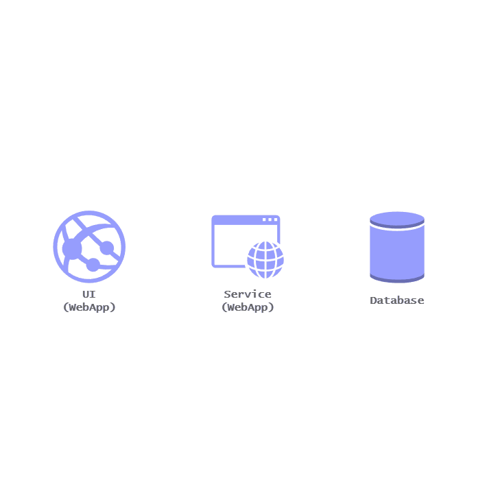

# 🏛️ Software Architecture in Essence: Three-Facet Mental Model

###### Wednesday, 15 July, 2026

Software architecture, in essence, is about **system structure**.

A simple way to understand system structure is by breaking it down into **three core facets**:

1. 🧩 Components
2. 🔗 Connections & Communication
3. 🌊 Data Flow

## 🧩 1. Components

Components are the individual structural parts of a system.

They exist at **two different levels**:

### 📦 Deployable Units

These are components that can be **compiled, packaged, deployed, and run independently**.

#### Examples

- Web Application
  * Frontend Application
  * Backend API Application
  * Backend Worker Application
- Microservice
  * Billing Microservice
  * Shipping Microservice
  * Inventory Microservice
- Infrastructure Component
  * Cache
  * Databases
  * Message Brokers

### 🏗️ Logical Units

These define the **high-level architectural boundaries** within a deployable unit. Their purpose is to organize code, enforce separation of concerns, and assign responsibilities.

#### Examples

- N-Layers
  * Presentation Layer
  * Application Layer
  * Domain Layer
  * Persistence Layer
- Clean Architecture
  * Presentation
  * Application
  * Domain
  * Infrastructure
- Modules inside Modular Monolith
  * Billing Module
  * Shipping Module
  * Inventory Module

## 🔗 2. Connections & Communication

Connections define **how components interact** with one another.

Common communication mechanisms include:

- REST APIs
- gRPC
- Webhooks
- Internal Messaging Bus (e.g., MediatR)
- Message Queues (e.g., RabbitMQ)
- Event Streaming

## 🌊 3. Data Flow

Data flow describes:

- How data moves from one component to another
- How data changes state throughout a business process
- The lifecycle of information as it travels across the system

A well-designed data flow helps ensure:

- Consistency
- Efficiency
- Reliability
- Scalability

## 🎯 Why These Three Facets Matter

These three facets help software architects define:

- Component boundaries
- Responsibilities
- Coupling between components
- Overall system organization, execution, and operation

Ultimately, software architecture is about making **trade-offs**.

Every architectural decision attempts to balance:

- 🎯 Business Goals
- ⭐ Quality Attributes

### 🎯 Business Goals

Business goals influence architectural choices based on project constraints.

- 💰 Budget
- ⏱️ Time-to-Delivery
- 👥 Team Size

### ⭐ Quality Attributes

Quality attributes determine how well a system performs beyond simply being functional.

| Attribute | Description |
|:-----------|:-------------|
| Scalability | Can the system handle **10,000 requests per second**? |
| Performance | Can it respond within **200 ms**? |
| Maintainability | Is it easy to understand, modify, and update? |
| Availability | Can it achieve **99.99% uptime**? |
| Extensibility | How easily can entirely new features be added without breaking the existing architecture? |
| Security | Can the system protect data and resist attacks? |
| Testability | Is the system easy to test automatically? |
| Reliability | Does it continue to operate correctly under expected conditions? |

## 💡 Key Takeaway

Software architecture is fundamentally about designing the **structure of a system** by carefully considering:

- 🧩 **Components** — What the system is made of
- 🔗 **Connections** — How those components communicate
- 🌊 **Data Flow** — How information moves through the system

Every architectural decision is ultimately a **trade-off** between achieving business objectives and meeting the desired quality attributes.